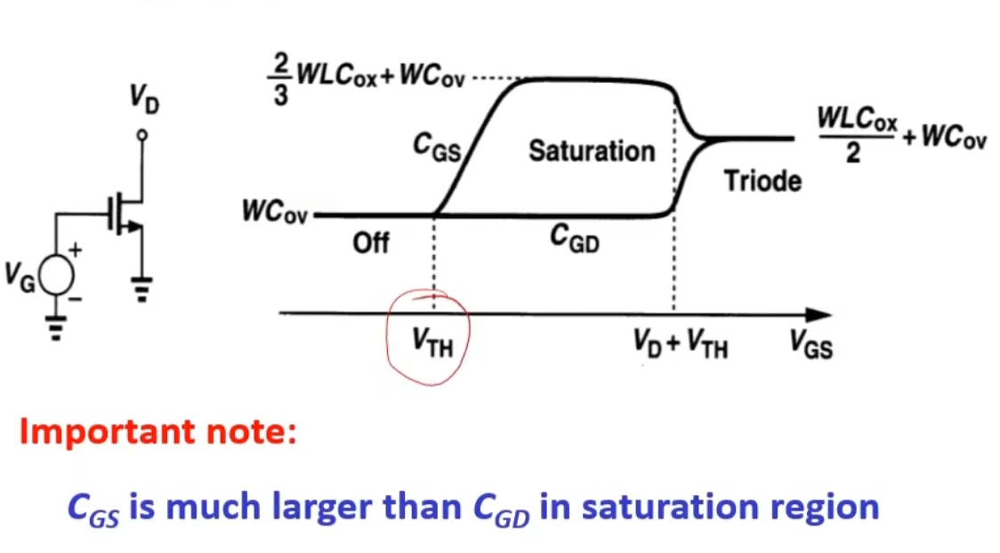
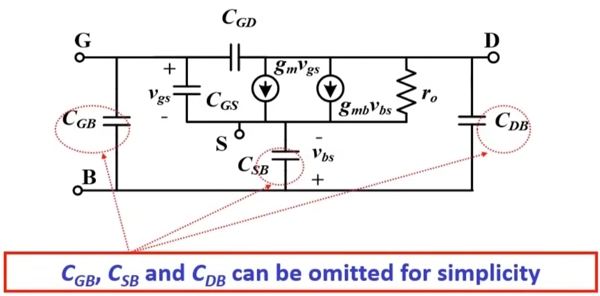

## MOSFET 基本概念
MOSFET 是一个四端器件 D G S B
标准CMOS工艺：无深阱（deep well），所有的NMOS同衬底电位，PMOS衬底电位单独可调
深N阱CMOS工艺：所有NMOS、PMOS的衬底电位都独立可调
模拟电路中的MOSFET：（1）作为开关（switch）；（2）作为电压控制电流源（VCCS）

## MOSFET 表征与模型
### 阈值电压 (VTH) 
工艺 Process: $t_{ox}$ 增大, $V_{TH}$ 减小, $N_{sub}$ 增大, $V_{TH}$ 增大
温度 Temperature: $T$ 增大, $V_{TH}$ 减小
电压 Voltage: $V_{BS}$ 增大, $V_{TH}$ 减小; $V_{DS}$ 增大, $V_{TH}$ 减小
### 大信号模型（I-V Model）
线性区：$I_D=\mu C_{ox}\frac{W}{L}(V_{GS}-V_{TH}-\frac{1}{2}V_{DS})V_{DS}$ ,$V_{DS}<V_{GS}-V_{TH}$
饱和区：$I_D=\mu C_{ox}\frac{W}{L'}(V_{GS}-V_{TH})^2$ ,$V_{DS}<V_{GS}-V_{TH}$
过驱动电压：$V_{OD}=\sqrt{\frac{2I_D}{\mu C_{ox} W/L'}}$
### 小信号模型
小信号模型就是MOSFET的线性化模型，即忽略了非线性项
小信号电导：$g_m=k_n\frac{W}{L}V_{OD}=\sqrt{2k_n\frac{W}{L}I_D}$,$k_n=\mu C_{ox}$
#### 二级效应
体效应 Body Effect：$g_{mb}=\sqrt{\frac{\gamma}{2\phi _F+V_{SB}}}g_m=\eta g_m$ 
沟道长度调制效应 Channel Length Modulation：$r_o=\frac{V_{DS}}{I_{D}}=\frac{1}{\lambda I_D}$
亚阈区电导：$I_D=I_0exp(\frac{V_{DS}}{\zeta V_{T}})$,$V_{DS}>4V_T~100 mV @ RT$
### MOSFET寄生电容
来源：氧化层电容$C_{ox}$,结电容$C_{junc}$,耗尽区电容$C_{dep}$，交叠电容$C_{ov}$
位置：$C_{GS}$,$C_{GD}$（最重要）
$C_{GS}$,$C_{GD}$,$C_{GS}$（可以通过折叠folder 或 叉指finger 工艺减少？）
   
### 完整的MOSFET小信号模型示意图
