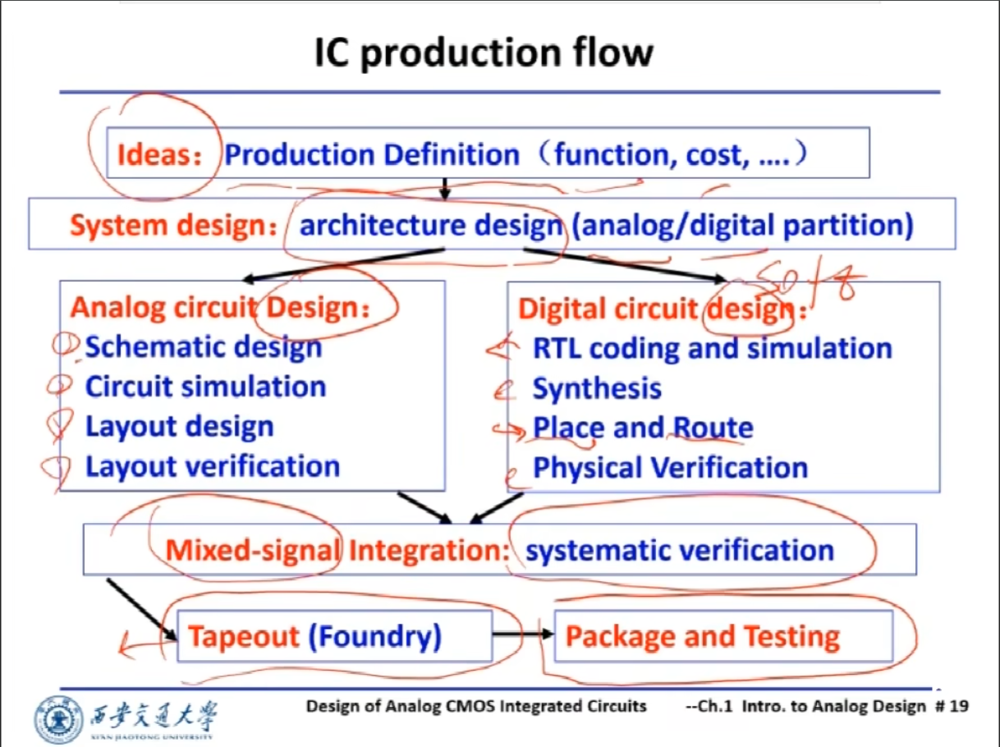
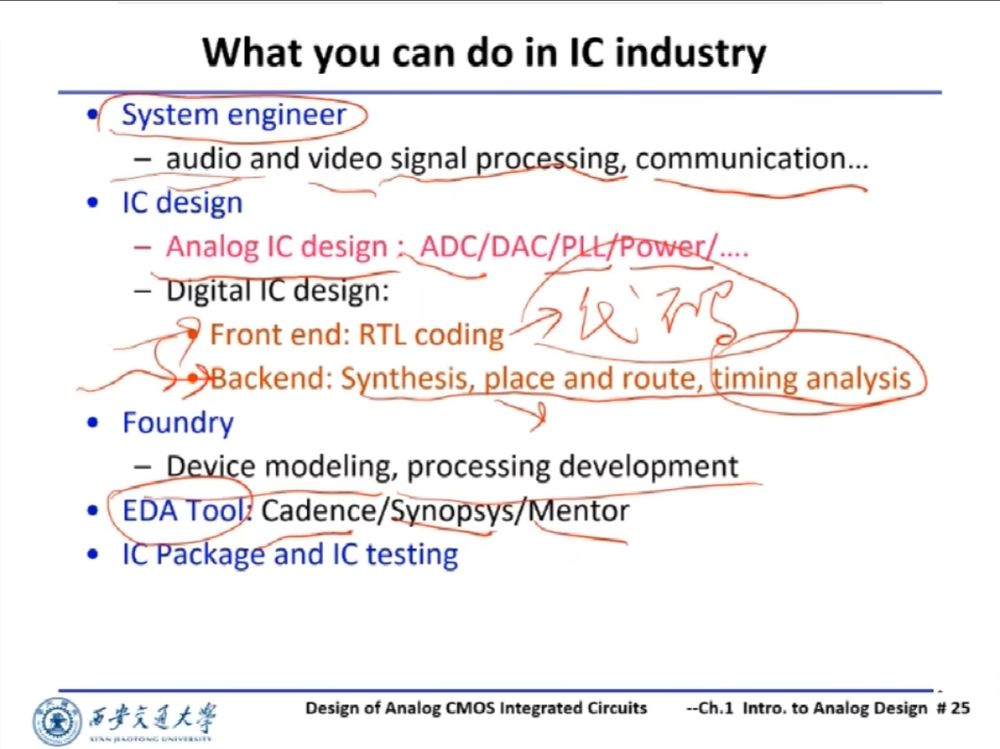
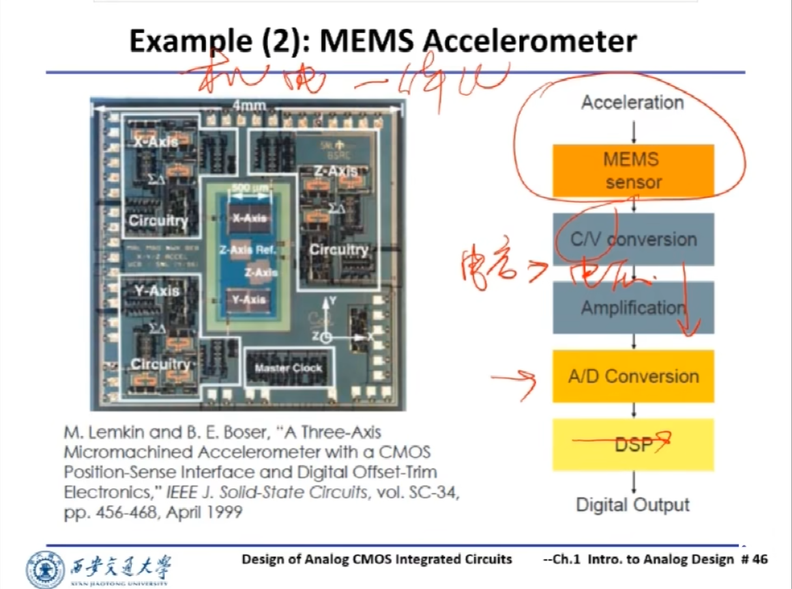
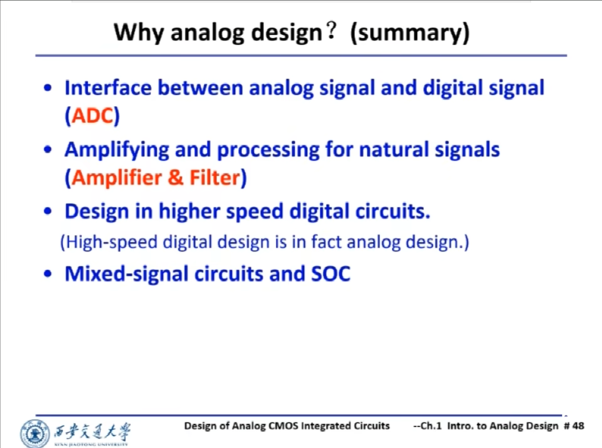
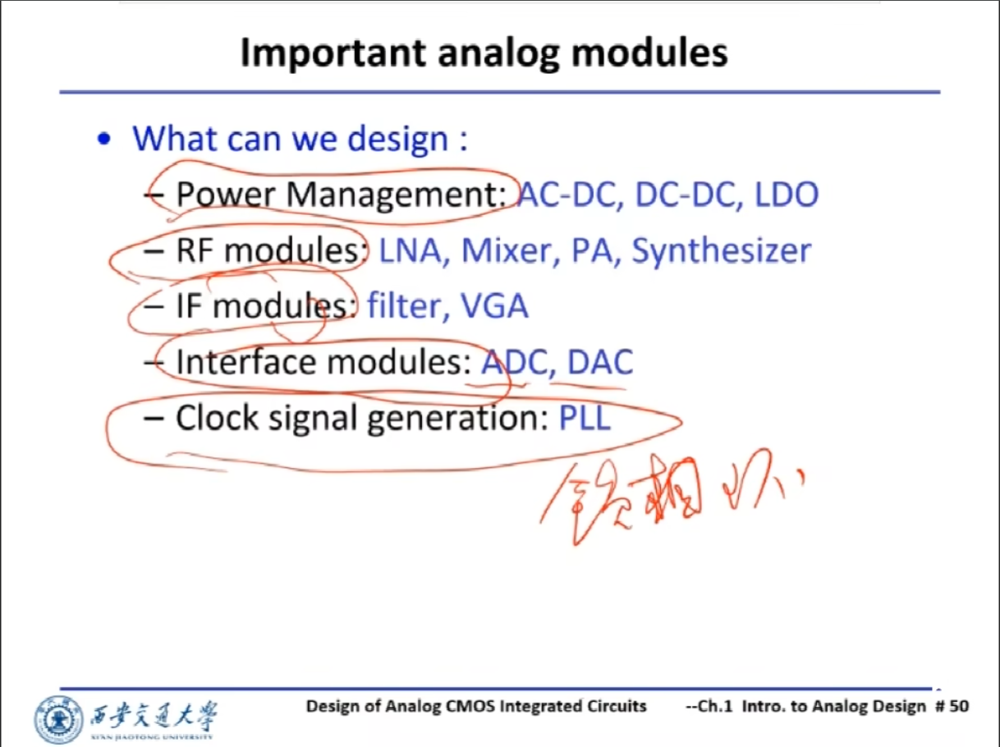

## IC production Flow
 

## What you can do in IC industry(Career List)

## Example(1) RF transceiver

## Example(2) MEMS Accelerometer

## Why analog design?

## Some important analog modules

